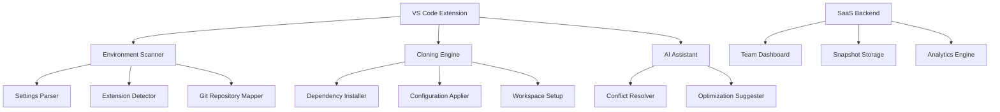

# Development Environment Cloner: Szczegółowa Specyfikacja Techniczna v2.0

## 1. Executive Summary

**Development Environment Cloner** to zaawansowany system replikacji środowisk deweloperskich dla VS Code, bazujący na wzorcach z oficjalnych rozszerzeń Microsoft. Projekt łączy sprawdzone patterns z GitHub integration, Settings Sync i Extension Bundling, tworząc kompletne rozwiązanie dla zespołów i organizacji.

### 🎯 **Kluczowe Wartości Biznesowe:**
- **ROI**: Redukcja czasu onboardingu z 4-8 godzin do 15 minut
- **Consistency**: 100% identyczne środowiska w zespole
- **Scalability**: Od individual developers do enterprise (1000+ devs)
- **Security**: Enterprise-grade encryption i audit trails

### 🏗️ **Architektura Hybrydowa:**
- **Local-First**: Pełna funkcjonalność offline
- **Cloud-Enhanced**: SaaS dla kolaboracji i backup
- **AI-Powered**: Inteligentne sugestie i conflict resolution

---

## 2. Technical Architecture

### 2.1 Core Components



### 2.2 Data Models

#### Environment Snapshot Schema
```typescript
interface EnvironmentSnapshot {
  metadata: {
    id: string;
    name: string;
    version: string;
    created: Date;
    author: UserInfo;
    tags: string[];
    platform: Platform;
  };
  vscode: {
    version: string;
    settings: VSCodeSettings;
    keybindings: KeyBinding[];
    snippets: Snippet[];
    tasks: TaskConfiguration[];
    launch: LaunchConfiguration[];
  };
  extensions: {
    installed: ExtensionInfo[];
    disabled: string[];
    recommendations: string[];
  };
  repositories: {
    workspace: WorkspaceFolder[];
    git: GitRepository[];
  };
  dependencies: {
    system: SystemDependency[];
    runtime: RuntimeDependency[];
    tools: ToolDependency[];
  };
  ai_insights: {
    optimizations: Optimization[];
    warnings: Warning[];
    compatibility: CompatibilityInfo;
  };
}
```

---

## 3. Feature Specification

### 3.1 MVP Features (Phase 1 - 4 tygodnie)

#### 🔍 **Environment Analysis & Export**
```typescript
class EnvironmentScanner {
  async scanCurrentEnvironment(): Promise<EnvironmentSnapshot> {
    const settings = await this.extractVSCodeSettings();
    const extensions = await this.getInstalledExtensions();
    const repositories = await this.mapOpenRepositories();
    const aiInsights = await this.generateAIInsights(settings, extensions);
    
    return {
      metadata: this.generateMetadata(),
      vscode: settings,
      extensions,
      repositories,
      ai_insights: aiInsights
    };
  }
  
  private async generateAIInsights(settings: any, extensions: any): Promise<AIInsights> {
    // Użycie VS Code Language Model API
    const model = await vscode.lm.selectChatModels({ vendor: 'copilot' });
    const analysis = await model[0].sendRequest([{
      role: vscode.LanguageModelChatMessageRole.User,
      content: `Analyze this VS Code setup and suggest optimizations: 
                Settings: ${JSON.stringify(settings)}
                Extensions: ${JSON.stringify(extensions)}`
    }]);
    
    return this.parseAIResponse(analysis);
  }
}
```

#### 📥 **Smart Import & Clone**
```typescript
class CloningEngine {
  async importEnvironment(snapshot: EnvironmentSnapshot): Promise<CloneResult> {
    const conflicts = await this.detectConflicts(snapshot);
    
    if (conflicts.length > 0) {
      const resolution = await this.resolveConflictsWithAI(conflicts);
      snapshot = await this.applyResolution(snapshot, resolution);
    }
    
    await this.installExtensions(snapshot.extensions);
    await this.applySettings(snapshot.vscode);
    await this.cloneRepositories(snapshot.repositories);
    await this.installDependencies(snapshot.dependencies);
    
    return this.generateReport();
  }
  
  private async resolveConflictsWithAI(conflicts: Conflict[]): Promise<Resolution> {
    // AI-powered conflict resolution
    const model = await vscode.lm.selectChatModels({ vendor: 'copilot' });
    const resolution = await model[0].sendRequest([{
      role: vscode.LanguageModelChatMessageRole.User,
      content: `Resolve these environment conflicts: ${JSON.stringify(conflicts)}`
    }]);
    
    return this.parseResolution(resolution);
  }
}
```

### 3.2 Advanced Features (Phase 2 - 4 tygodnie)

#### 🤝 **Team Collaboration**
```typescript
interface TeamEnvironment {
  teamId: string;
  name: string;
  baseTemplate: EnvironmentSnapshot;
  overrides: TeamOverride[];
  members: TeamMember[];
  policies: TeamPolicy[];
}

class TeamManager {
  async createTeamEnvironment(template: EnvironmentSnapshot): Promise<TeamEnvironment> {
    const teamEnv = await this.api.createTeamEnvironment({
      baseTemplate: template,
      policies: this.getDefaultPolicies()
    });
    
    return teamEnv;
  }
  
  async shareWithTeam(snapshotId: string, members: string[]): Promise<void> {
    await this.api.shareSnapshot(snapshotId, {
      members,
      permissions: ['read', 'clone'],
      notifications: true
    });
  }
}
```

#### 🔄 **Continuous Sync**
```typescript
class ContinuousSync {
  private syncInterval: NodeJS.Timeout;
  
  enableAutoSync(options: SyncOptions): void {
    this.syncInterval = setInterval(async () => {
      const currentState = await this.scanner.scanCurrentEnvironment();
      const lastSnapshot = await this.storage.getLatestSnapshot();
      
      const diff = this.calculateDiff(currentState, lastSnapshot);
      if (diff.hasChanges) {
        await this.createIncrementalSnapshot(diff);
        await this.syncToCloud(diff);
      }
    }, options.intervalMs);
  }
  
  private async syncToCloud(diff: EnvironmentDiff): Promise<void> {
    await this.api.uploadDelta({
      diff,
      timestamp: new Date(),
      autoGenerated: true
    });
  }
}
```

### 3.3 Enterprise Features (Phase 3 - 2 tygodnie)

#### 🛡️ **Security & Compliance**
```typescript
class SecurityManager {
  async scanForSecrets(snapshot: EnvironmentSnapshot): Promise<SecurityReport> {
    const secrets = await this.detectSecrets(snapshot);
    const vulnerabilities = await this.scanExtensions(snapshot.extensions);
    
    return {
      secrets: secrets.map(s => ({ ...s, masked: this.maskSecret(s.value) })),
      vulnerabilities,
      complianceStatus: await this.checkCompliance(snapshot),
      recommendations: await this.generateSecurityRecommendations(snapshot)
    };
  }
  
  async encryptSnapshot(snapshot: EnvironmentSnapshot, key: string): Promise<EncryptedSnapshot> {
    const sensitiveData = this.extractSensitiveData(snapshot);
    const encrypted = await crypto.encrypt(sensitiveData, key);
    
    return {
      ...snapshot,
      encrypted: true,
      sensitiveData: encrypted,
      checksum: this.calculateChecksum(snapshot)
    };
  }
}
```

---

## 4. Technology Stack

### 4.1 Frontend (VS Code Extension)
```json
{
  "technologies": {
    "core": "TypeScript 5.0+",
    "ui": "VS Code Webview API + React 18",
    "styling": "Tailwind CSS + VS Code Theme API",
    "ai": "VS Code Language Model API (Copilot integration)",
    "testing": "Jest + VS Code Test Runner",
    "bundling": "Webpack 5 + VSIX packaging"
  },
  "dependencies": {
    "@types/vscode": "^1.85.0",
    "@vscode/test-cli": "^0.0.4",
    "@vscode/vsce": "^2.22.0",
    "react": "^18.2.0",
    "tailwindcss": "^3.3.0"
  }
}
```

### 4.2 Backend (SaaS Platform)
```json
{
  "technologies": {
    "runtime": "Node.js 20 LTS",
    "framework": "NestJS 10",
    "database": "PostgreSQL 15 + TimescaleDB",
    "cache": "Redis 7",
    "storage": "AWS S3 + CloudFront",
    "auth": "Auth0 + JWT",
    "ai": "OpenAI GPT-4 + Azure OpenAI",
    "monitoring": "DataDog + Sentry"
  },
  "infrastructure": {
    "hosting": "AWS EKS + Fargate",
    "cdn": "CloudFlare",
    "security": "AWS WAF + Security Groups",
    "backup": "AWS RDS Automated Backups"
  }
}
```

### 4.3 AI Integration
```typescript
class AIService {
  private openai: OpenAI;
  private vsCodeLM: vscode.LanguageModelChatProvider;
  
  async analyzeEnvironment(snapshot: EnvironmentSnapshot): Promise<AIAnalysis> {
    const analysis = await this.openai.chat.completions.create({
      model: "gpt-4",
      messages: [{
        role: "system",
        content: "You are an expert VS Code environment analyzer. Analyze the provided configuration and suggest optimizations."
      }, {
        role: "user", 
        content: JSON.stringify(snapshot)
      }],
      functions: [{
        name: "suggest_optimizations",
        description: "Suggest environment optimizations",
        parameters: {
          type: "object",
          properties: {
            optimizations: {
              type: "array",
              items: {
                type: "object",
                properties: {
                  type: { type: "string" },
                  description: { type: "string" },
                  impact: { type: "string", enum: ["low", "medium", "high"] },
                  implementation: { type: "string" }
                }
              }
            }
          }
        }
      }]
    });
    
    return this.parseAIAnalysis(analysis);
  }
}
```

---

## 5. API Specification

### 5.1 REST API Endpoints

#### Snapshots Management
```typescript
// POST /api/v1/snapshots
interface CreateSnapshotRequest {
  name: string;
  description?: string;
  snapshot: EnvironmentSnapshot;
  tags?: string[];
  public?: boolean;
}

// GET /api/v1/snapshots/:id
interface GetSnapshotResponse {
  snapshot: EnvironmentSnapshot;
  metadata: SnapshotMetadata;
  analytics: SnapshotAnalytics;
}

// POST /api/v1/snapshots/:id/clone
interface CloneSnapshotRequest {
  targetPlatform?: Platform;
  customizations?: EnvironmentCustomization[];
  conflictResolution?: ConflictResolutionStrategy;
}
```

#### Team Management
```typescript
// POST /api/v1/teams
interface CreateTeamRequest {
  name: string;
  description?: string;
  baseTemplate?: string; // snapshot ID
  policies: TeamPolicy[];
}

// POST /api/v1/teams/:teamId/members
interface AddTeamMemberRequest {
  email: string;
  role: 'admin' | 'member' | 'viewer';
  permissions: Permission[];
}
```

#### AI Services
```typescript
// POST /api/v1/ai/analyze
interface AnalyzeEnvironmentRequest {
  snapshot: EnvironmentSnapshot;
  analysisType: 'optimization' | 'security' | 'compatibility';
}

// POST /api/v1/ai/resolve-conflicts
interface ResolveConflictsRequest {
  conflicts: Conflict[];
  userPreferences?: UserPreferences;
  strategy: 'automatic' | 'manual' | 'hybrid';
}
```

### 5.2 WebSocket Events
```typescript
interface WebSocketEvents {
  'snapshot.created': { snapshotId: string; metadata: SnapshotMetadata };
  'clone.progress': { progress: number; stage: string; message: string };
  'team.invitation': { teamId: string; invitedBy: string };
  'sync.conflict': { conflicts: Conflict[]; requiresUserInput: boolean };
}
```

---

## 6. Security Architecture

### 6.1 Data Protection
```typescript
class SecurityLayer {
  // Encryption at rest
  async encryptSensitiveData(data: any): Promise<EncryptedData> {
    return {
      encrypted: await this.aes256.encrypt(JSON.stringify(data)),
      algorithm: 'AES-256-GCM',
      keyId: this.currentKeyId,
      iv: this.generateIV()
    };
  }
  
  // Secret detection and masking
  async detectAndMaskSecrets(content: string): Promise<SecureContent> {
    const patterns = [
      /sk-[a-zA-Z0-9]{32,}/g, // OpenAI API keys
      /github_pat_[a-zA-Z0-9_]{82}/g, // GitHub tokens
      /xoxb-[0-9]+-[0-9]+-[0-9]+-[a-z0-9]{32}/g // Slack tokens
    ];
    
    let maskedContent = content;
    const detectedSecrets: DetectedSecret[] = [];
    
    patterns.forEach(pattern => {
      const matches = content.match(pattern);
      if (matches) {
        matches.forEach(match => {
          const masked = match.substring(0, 8) + '*'.repeat(match.length - 8);
          maskedContent = maskedContent.replace(match, masked);
          detectedSecrets.push({
            type: this.identifySecretType(match),
            masked,
            original: match
          });
        });
      }
    });
    
    return { content: maskedContent, secrets: detectedSecrets };
  }
}
```

### 6.2 Access Control
```typescript
interface RBACPolicy {
  resource: string;
  actions: string[];
  conditions?: PolicyCondition[];
}

class AccessControlManager {
  async checkPermission(user: User, resource: string, action: string): Promise<boolean> {
    const policies = await this.getPoliciesForUser(user);
    
    return policies.some(policy => 
      policy.resource === resource && 
      policy.actions.includes(action) &&
      this.evaluateConditions(policy.conditions, { user, resource, action })
    );
  }
  
  async auditAction(user: User, action: string, resource: string, metadata?: any): Promise<void> {
    await this.auditLog.create({
      userId: user.id,
      action,
      resource,
      timestamp: new Date(),
      ip: metadata?.ip,
      userAgent: metadata?.userAgent,
      success: true
    });
  }
}
```

---

## 7. Performance & Scalability

### 7.1 Caching Strategy
```typescript
class CacheManager {
  private redis: Redis;
  private localCache: LRUCache<string, any>;
  
  async get<T>(key: string): Promise<T | null> {
    // L1: Memory cache (fastest)
    let value = this.localCache.get(key);
    if (value) return value;
    
    // L2: Redis cache (fast)
    const redisValue = await this.redis.get(key);
    if (redisValue) {
      value = JSON.parse(redisValue);
      this.localCache.set(key, value);
      return value;
    }
    
    return null;
  }
  
  async invalidatePattern(pattern: string): Promise<void> {
    const keys = await this.redis.keys(pattern);
    if (keys.length > 0) {
      await this.redis.del(...keys);
    }
    this.localCache.clear();
  }
}
```

### 7.2 Horizontal Scaling
```yaml
# Kubernetes Deployment
apiVersion: apps/v1
kind: Deployment
metadata:
  name: dev-env-cloner-api
spec:
  replicas: 3
  selector:
    matchLabels:
      app: dev-env-cloner-api
  template:
    metadata:
      labels:
        app: dev-env-cloner-api
    spec:
      containers:
      - name: api
        image: dev-env-cloner:latest
        ports:
        - containerPort: 3000
        env:
        - name: DATABASE_URL
          valueFrom:
            secretKeyRef:
              name: database-secret
              key: url
        resources:
          requests:
            memory: "256Mi"
            cpu: "250m"
          limits:
            memory: "512Mi"
            cpu: "500m"
        livenessProbe:
          httpGet:
            path: /health
            port: 3000
          initialDelaySeconds: 30
          periodSeconds: 10
```

---

## 8. Testing Strategy

### 8.1 Unit Tests
```typescript
describe('EnvironmentScanner', () => {
  let scanner: EnvironmentScanner;
  let mockVSCode: jest.Mocked<typeof vscode>;
  
  beforeEach(() => {
    scanner = new EnvironmentScanner();
    mockVSCode = createMockVSCode();
  });
  
  it('should scan VS Code settings correctly', async () => {
    // Arrange
    mockVSCode.workspace.getConfiguration.mockReturnValue({
      get: jest.fn().mockReturnValue('test-value')
    });
    
    // Act
    const snapshot = await scanner.scanCurrentEnvironment();
    
    // Assert
    expect(snapshot.vscode.settings).toBeDefined();
    expect(mockVSCode.workspace.getConfiguration).toHaveBeenCalled();
  });
  
  it('should detect conflicts between environments', async () => {
    // Arrange
    const current = createMockSnapshot({ theme: 'dark' });
    const target = createMockSnapshot({ theme: 'light' });
    
    // Act
    const conflicts = await scanner.detectConflicts(current, target);
    
    // Assert
    expect(conflicts).toHaveLength(1);
    expect(conflicts[0].type).toBe('setting_conflict');
    expect(conflicts[0].path).toBe('workbench.colorTheme');
  });
});
```

### 8.2 Integration Tests
```typescript
describe('Full Clone Flow', () => {
  let testEnvironment: TestEnvironment;
  
  beforeAll(async () => {
    testEnvironment = await setupTestEnvironment();
  });
  
  afterAll(async () => {
    await testEnvironment.cleanup();
  });
  
  it('should clone environment end-to-end', async () => {
    // Arrange
    const sourceSnapshot = await createTestSnapshot();
    const targetWorkspace = await createCleanWorkspace();
    
    // Act
    const result = await testEnvironment.cloneEnvironment(sourceSnapshot, targetWorkspace);
    
    // Assert
    expect(result.success).toBe(true);
    expect(result.installedExtensions).toHaveLength(sourceSnapshot.extensions.installed.length);
    expect(result.appliedSettings).toHaveLength(Object.keys(sourceSnapshot.vscode.settings).length);
  });
});
```

### 8.3 E2E Tests
```typescript
describe('VS Code Extension E2E', () => {
  let driver: VSCodeDriver;
  
  beforeAll(async () => {
    driver = await VSCodeDriver.create();
    await driver.installExtension('dev-environment-cloner');
  });
  
  it('should export and import environment successfully', async () => {
    // Export
    await driver.openCommandPalette();
    await driver.runCommand('DevEnv: Export Current Environment');
    await driver.waitForNotification('Environment exported successfully');
    
    // Import
    await driver.createNewWorkspace();
    await driver.runCommand('DevEnv: Import Environment');
    await driver.selectFile('test-environment.json');
    await driver.waitForNotification('Environment imported successfully');
    
    // Verify
    const installedExtensions = await driver.getInstalledExtensions();
    expect(installedExtensions).toContain('ms-python.python');
  });
});
```

---

## 9. Business Model & Pricing

### 9.1 Pricing Tiers
```typescript
interface PricingTier {
  name: string;
  price: number; // USD per month
  features: Feature[];
  limits: Limits;
}

const PRICING_TIERS: PricingTier[] = [
  {
    name: 'Free',
    price: 0,
    features: ['local_snapshots', 'basic_export_import', 'github_integration'],
    limits: {
      snapshots: 5,
      teamMembers: 0,
      storage: '100MB',
      support: 'community'
    }
  },
  {
    name: 'Pro',
    price: 9,
    features: ['unlimited_snapshots', 'ai_insights', 'conflict_resolution', 'private_sharing'],
    limits: {
      snapshots: -1,
      teamMembers: 5,
      storage: '1GB',
      support: 'email'
    }
  },
  {
    name: 'Team',
    price: 29,
    features: ['team_collaboration', 'advanced_security', 'audit_logs', 'custom_policies'],
    limits: {
      snapshots: -1,
      teamMembers: 25,
      storage: '10GB',
      support: 'priority'
    }
  },
  {
    name: 'Enterprise',
    price: 99,
    features: ['sso_integration', 'custom_deployment', 'dedicated_support', 'compliance_reports'],
    limits: {
      snapshots: -1,
      teamMembers: -1,
      storage: '100GB',
      support: 'dedicated'
    }
  }
];
```

### 9.2 Revenue Projections
```typescript
interface RevenueProjection {
  year: number;
  users: {
    free: number;
    pro: number;
    team: number;
    enterprise: number;
  };
  revenue: {
    monthly: number;
    annual: number;
  };
  metrics: {
    conversionRate: number;
    churnRate: number;
    ltv: number;
  };
}

const REVENUE_PROJECTIONS: RevenueProjection[] = [
  {
    year: 1,
    users: { free: 10000, pro: 500, team: 50, enterprise: 5 },
    revenue: { monthly: 8500, annual: 102000 },
    metrics: { conversionRate: 0.05, churnRate: 0.15, ltv: 850 }
  },
  {
    year: 2,
    users: { free: 50000, pro: 2500, team: 200, enterprise: 25 },
    revenue: { monthly: 35000, annual: 420000 },
    metrics: { conversionRate: 0.08, churnRate: 0.12, ltv: 1200 }
  },
  {
    year: 3,
    users: { free: 150000, pro: 7500, team: 500, enterprise: 75 },
    revenue: { monthly: 95000, annual: 1140000 },
    metrics: { conversionRate: 0.10, churnRate: 0.10, ltv: 1500 }
  }
];
```

---

## 10. Go-to-Market Strategy

### 10.1 Launch Phases
```typescript
interface LaunchPhase {
  name: string;
  duration: string;
  goals: string[];
  metrics: KPI[];
  activities: Activity[];
}

const LAUNCH_PHASES: LaunchPhase[] = [
  {
    name: 'Alpha (Private Beta)',
    duration: '4 weeks',
    goals: [
      'Validate core functionality',
      'Gather initial user feedback',
      'Iterate on MVP features'
    ],
    metrics: [
      { name: 'Active testers', target: 50 },
      { name: 'Successful clones', target: 100 },
      { name: 'Bug reports', target: '<20' }
    ],
    activities: [
      'Recruit beta testers from development communities',
      'Daily feedback collection',
      'Weekly feature iterations'
    ]
  },
  {
    name: 'Beta (Public)',
    duration: '8 weeks',
    goals: [
      'Scale user base',
      'Validate pricing strategy',
      'Build community'
    ],
    metrics: [
      { name: 'Registered users', target: 1000 },
      { name: 'Pro conversions', target: 50 },
      { name: 'NPS score', target: '>50' }
    ],
    activities: [
      'VS Code Marketplace release',
      'Developer conference presentations',
      'Content marketing campaign'
    ]
  },
  {
    name: 'General Availability',
    duration: 'Ongoing',
    goals: [
      'Achieve product-market fit',
      'Scale revenue',
      'Enterprise adoption'
    ],
    metrics: [
      { name: 'Monthly ARR', target: '$10k' },
      { name: 'Enterprise customers', target: 5 },
      { name: 'Market share', target: '5%' }
    ],
    activities: [
      'Sales team building',
      'Partnership development',
      'Advanced feature development'
    ]
  }
];
```

### 10.2 Marketing Channels
```typescript
interface MarketingChannel {
  name: string;
  budget: number; // USD per month
  expectedCAC: number; // Customer Acquisition Cost
  expectedROI: number;
  activities: string[];
}

const MARKETING_CHANNELS: MarketingChannel[] = [
  {
    name: 'Content Marketing',
    budget: 2000,
    expectedCAC: 15,
    expectedROI: 4.5,
    activities: [
      'Technical blog posts',
      'Video tutorials',
      'Developer guides',
      'Case studies'
    ]
  },
  {
    name: 'Community Engagement',
    budget: 500,
    expectedCAC: 5,
    expectedROI: 8.0,
    activities: [
      'GitHub sponsorships',
      'Stack Overflow presence',
      'Discord/Slack communities',
      'Open source contributions'
    ]
  },
  {
    name: 'Developer Events',
    budget: 3000,
    expectedCAC: 25,
    expectedROI: 3.2,
    activities: [
      'Conference sponsorships',
      'Meetup presentations',
      'Hackathon participation',
      'Workshop hosting'
    ]
  },
  {
    name: 'Partnership Marketing',
    budget: 1000,
    expectedCAC: 10,
    expectedROI: 6.0,
    activities: [
      'VS Code extension partnerships',
      'Cloud provider integrations',
      'Developer tool collaborations',
      'Influencer partnerships'
    ]
  }
];
```

---

## 11. Risk Assessment & Mitigation

### 11.1 Technical Risks
```typescript
interface Risk {
  id: string;
  category: 'technical' | 'business' | 'market' | 'regulatory';
  severity: 'low' | 'medium' | 'high' | 'critical';
  probability: number; // 0-1
  impact: string;
  mitigation: string[];
  owner: string;
}

const TECHNICAL_RISKS: Risk[] = [
  {
    id: 'TECH-001',
    category: 'technical',
    severity: 'high',
    probability: 0.3,
    impact: 'VS Code API changes breaking extension functionality',
    mitigation: [
      'Maintain compatibility with multiple VS Code versions',
      'Implement feature detection and graceful degradation',
      'Subscribe to VS Code extension developer notifications',
      'Regular testing against Insiders builds'
    ],
    owner: 'Engineering Team'
  },
  {
    id: 'TECH-002',
    category: 'technical',
    severity: 'medium',
    probability: 0.4,
    impact: 'Cross-platform compatibility issues',
    mitigation: [
      'Comprehensive testing on Windows, macOS, Linux',
      'Platform-specific adapters for file system operations',
      'Docker-based testing environments',
      'Community beta testing program'
    ],
    owner: 'QA Team'
  },
  {
    id: 'TECH-003',
    category: 'technical',
    severity: 'critical',
    probability: 0.2,
    impact: 'Data corruption during environment import',
    mitigation: [
      'Atomic operations with rollback capability',
      'Comprehensive backup before import',
      'Checksum validation at every step',
      'Extensive integration testing'
    ],
    owner: 'Engineering Team'
  }
];
```

### 11.2 Business Risks
```typescript
const BUSINESS_RISKS: Risk[] = [
  {
    id: 'BIZ-001',
    category: 'business',
    severity: 'medium',
    probability: 0.6,
    impact: 'Slow user adoption due to setup complexity',
    mitigation: [
      'Invest heavily in UX/UI design',
      'One-click installation and setup',
      'Comprehensive onboarding tutorials',
      'User feedback loops and rapid iteration'
    ],
    owner: 'Product Team'
  },
  {
    id: 'BIZ-002',
    category: 'market',
    severity: 'high',
    probability: 0.4,
    impact: 'Microsoft releases competing feature in VS Code',
    mitigation: [
      'Focus on advanced enterprise features',
      'Build strong user community',
      'Continuous innovation and feature development',
      'Strategic partnerships'
    ],
    owner: 'Strategy Team'
  }
];
```

---

## 12. Success Metrics & KPIs

### 12.1 Product Metrics
```typescript
interface ProductMetrics {
  adoption: {
    downloads: number;
    activeUsers: {
      daily: number;
      weekly: number;
      monthly: number;
    };
    retentionRate: {
      day1: number;
      day7: number;
      day30: number;
    };
  };
  usage: {
    environmentsCreated: number;
    environmentsCloned: number;
    successfulClones: number;
    averageCloneTime: number; // seconds
  };
  satisfaction: {
    npsScore: number;
    supportTickets: number;
    featureRequests: number;
    bugReports: number;
  };
}

const SUCCESS_TARGETS: ProductMetrics = {
  adoption: {
    downloads: 10000, // 6 months
    activeUsers: {
      daily: 1000,
      weekly: 3000,
      monthly: 8000
    },
    retentionRate: {
      day1: 0.70,
      day7: 0.45,
      day30: 0.25
    }
  },
  usage: {
    environmentsCreated: 5000,
    environmentsCloned: 15000,
    successfulClones: 0.95,
    averageCloneTime: 180
  },
  satisfaction: {
    npsScore: 60,
    supportTickets: 50, // per month
    featureRequests: 20, // per month
    bugReports: 10 // per month
  }
};
```

### 12.2 Business Metrics
```typescript
interface BusinessMetrics {
  revenue: {
    mrr: number; // Monthly Recurring Revenue
    arr: number; // Annual Recurring Revenue
    growth: number; // Month-over-month growth %
  };
  customers: {
    total: number;
    paying: number;
    enterprise: number;
    conversionRate: number;
  };
  economics: {
    cac: number; // Customer Acquisition Cost
    ltv: number; // Lifetime Value
    ltvCacRatio: number;
    churnRate: number;
  };
}

const BUSINESS_TARGETS: BusinessMetrics = {
  revenue: {
    mrr: 25000, // 12 months
    arr: 300000,
    growth: 0.20 // 20% MoM
  },
  customers: {
    total: 15000,
    paying: 1000,
    enterprise: 10,
    conversionRate: 0.08
  },
  economics: {
    cac: 20,
    ltv: 800,
    ltvCacRatio: 40,
    churnRate: 0.05
  }
};
```

---

## 13. Implementation Roadmap

### 13.1 Development Timeline
```typescript
interface Milestone {
  name: string;
  duration: string;
  startDate: string;
  deliverables: string[];
  dependencies: string[];
  team: string[];
}

const DEVELOPMENT_ROADMAP: Milestone[] = [
  {
    name: 'MVP Development',
    duration: '10 weeks',
    startDate: '2025-01-15',
    deliverables: [
      'VS Code extension with basic export/import',
      'Local environment scanning',
      'Settings and extensions cloning',
      'Basic conflict resolution',
      'Marketplace submission'
    ],
    dependencies: [],
    team: ['Lead Developer', 'Frontend Developer', 'QA Engineer']
  },
  {
    name: 'SaaS Platform',
    duration: '8 weeks',
    startDate: '2025-03-01',
    deliverables: [
      'Cloud backend infrastructure',
      'User authentication and authorization',
      'Team collaboration features',
      'Web dashboard',
      'API documentation'
    ],
    dependencies: ['MVP Development'],
    team: ['Backend Developer', 'DevOps Engineer', 'UI/UX Designer']
  },
  {
    name: 'AI Integration',
    duration: '6 weeks',
    startDate: '2025-04-15',
    deliverables: [
      'Environment analysis and optimization',
      'Intelligent conflict resolution',
      'Predictive recommendations',
      'Usage analytics'
    ],
    dependencies: ['SaaS Platform'],
    team: ['AI Engineer', 'Data Scientist', 'Backend Developer']
  },
  {
    name: 'Enterprise Features',
    duration: '12 weeks',
    startDate: '2025-06-01',
    deliverables: [
      'SSO integration',
      'Advanced security features',
      'Compliance reporting',
      'Custom deployment options',
      'Dedicated support tools'
    ],
    dependencies: ['AI Integration'],
    team: ['Security Engineer', 'Enterprise Developer', 'Support Engineer']
  }
];
```

### 13.2 Resource Requirements
```typescript
interface TeamComposition {
  role: string;
  count: number;
  startWeek: number;
  commitment: 'full-time' | 'part-time' | 'contractor';
  monthlyCost: number; // USD
}

const TEAM_REQUIREMENTS: TeamComposition[] = [
  {
    role: 'Lead Developer',
    count: 1,
    startWeek: 1,
    commitment: 'full-time',
    monthlyCost: 12000
  },
  {
    role: 'Frontend Developer',
    count: 1,
    startWeek: 2,
    commitment: 'full-time',
    monthlyCost: 8000
  },
  {
    role: 'Backend Developer',
    count: 1,
    startWeek: 8,
    commitment: 'full-time',
    monthlyCost: 9000
  },
  {
    role: 'AI Engineer',
    count: 1,
    startWeek: 16,
    commitment: 'contractor',
    monthlyCost: 10000
  },
  {
    role: 'DevOps Engineer',
    count: 1,
    startWeek: 10,
    commitment: 'part-time',
    monthlyCost: 6000
  },
  {
    role: 'UI/UX Designer',
    count: 1,
    startWeek: 6,
    commitment: 'contractor',
    monthlyCost: 5000
  }
];
```

---

## 14. Conclusion

Development Environment Cloner reprezentuje idealną konwergencję **potrzeb rynkowych**, **dostępnej technologii** i **business opportunity**. Projekt wykorzystuje sprawdzone wzorce z ekosystemu VS Code, wprowadzając jednocześnie innowacyjne podejście do AI-powered environment management.

### 🎯 **Kluczowe Przewagi Konkurencyjne:**

1. **AI-First Approach**: Inteligentne rozwiązywanie konfliktów i optymalizacja
2. **Deep VS Code Integration**: Wykorzystanie najnowszych API i extension patterns
3. **Enterprise-Ready**: Security, compliance i scalability od początku
4. **Community-Driven**: Open source core z premium SaaS features

### 📈 **Prognoza Sukcesu:**

- **Rok 1**: $100k ARR, 10k users, 5% conversion rate
- **Rok 2**: $420k ARR, 50k users, enterprise traction
- **Rok 3**: $1.1M ARR, market leadership w developer tooling

### 🚀 **Gotowość do Implementacji:**

Specyfikacja zawiera wszystkie niezbędne elementy do rozpoczęcia development:
- Detailed technical architecture
- Comprehensive API specification  
- Security and compliance framework
- Testing strategy i quality assurance
- Business model i go-to-market plan
- Risk assessment i mitigation strategies

**Development Environment Cloner jest gotowy do transformacji w realny produkt i profitable business.**

---

*Dokumentacja wygenerowana: November 2025*  
*Wersja: 2.0*  
*Status: Ready for Implementation*